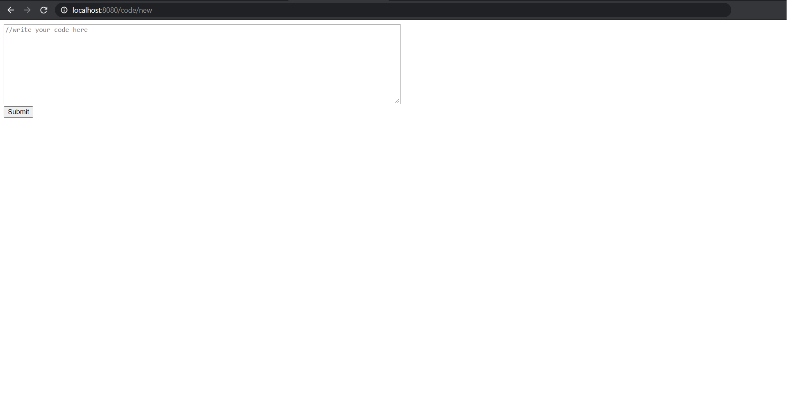
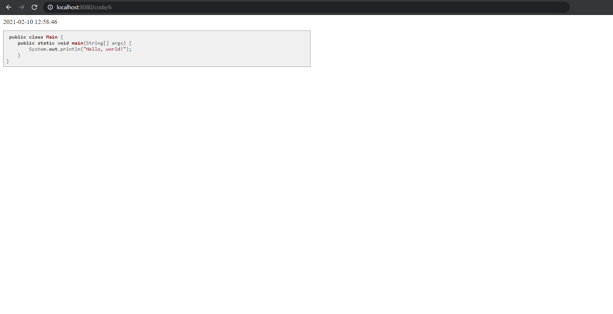
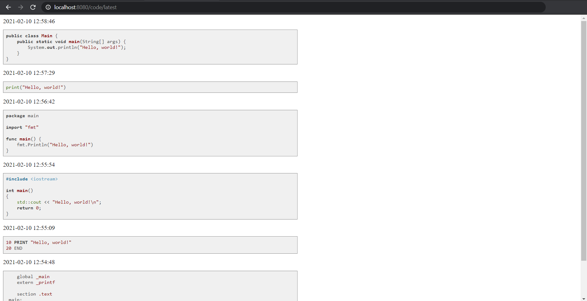

# Project Name
> Code-Sharing-Platform

## Table of contents
* [General info](#general-info)
* [Technologies](#technologies)
* [Features](#features)
* [Examples](#examples)
* [Status](#status)

## General info
There is a lot of collaboration in programming: many projects require sharing your code with other developers. Using open web resources such as Pastebin is not always an option. In this project, I create code sharing platform.

## Technologies
* java - version 15.0.1
* gradle - version 6.8
* spring boot - version 2.4.2
* apache freemarker - version 2.3.30
* h2 database engine - version 1.4.200

## Features
The program support following endpoints:
* ```GET /api/code/N``` return JSON with the N-th uploaded code snippet.
* ```GET /code/N``` return HTML that contains the N-th uploaded code snippet.
* ```POST /api/code/new``` take a JSON object with a single field ```code```, use it as the current code snippet, and return JSON with a single field ```id```. ID is the unique number of the code snippet that can help you access it via the endpoint ```GET /code/N```.
* ```GET /code/new``` return HTML that contains textarea where you can paste a code snippet, and a button to submit the code snippet.
* ```GET api/code/latest``` return a JSON array with 10 most recently uploaded code snippets sorted from newest to the oldest.
* ```GET code/latest``` return HTML that contains 10 most recently uploaded code snippets sorted from newest to the oldest.

## Examples
* Example 1
  Request ```POST /api/code/new``` with the following body:
  ```{"code": "class Code {..."}```
  Response: ```{"id": "1"}```
   
 
* Example 2
  Request: ```GET /api/code/1```
  Response: ```{"code": "class Code {...",
  "date": "2021-02-10 12:10:55"```
  

* Example 3
  Request: ```GET /api/code/latest```
  Response: ```[{"code": "public static void ...","date": "2021-02-10 12:10:55"},{"code": "class Code {...","date": "2021-02-10 12:05:45"}]```
  

* Example 4
  
  

* Example 5
  
  

* Example 6
  

## Status
Project is: _finished_